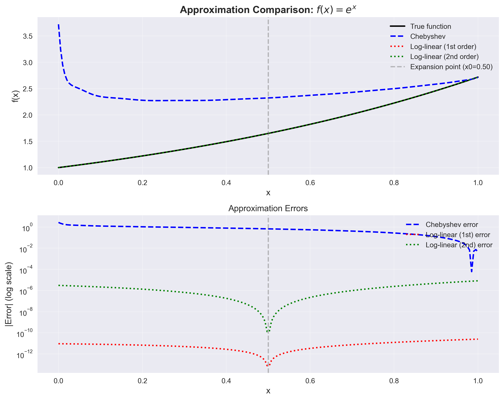
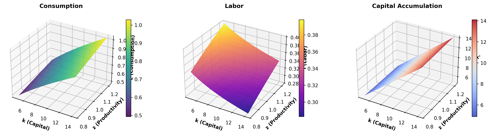
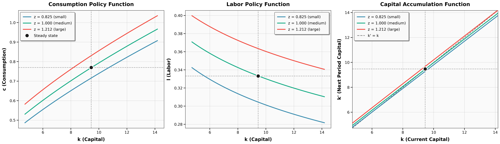
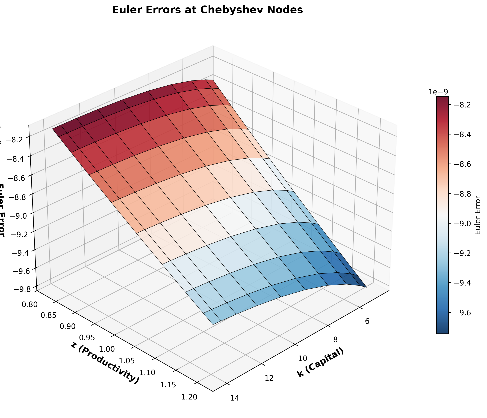

# Computational Economics: Projection Methods and NGM Applications

This repository contains implementations of numerical methods for solving dynamic economic models, focusing on **Projection Methods** (Chebyshev Polynomials) and their application to the **Neoclassical Growth Model (NGM)**.

## Project Overview

The project is structured to demonstrate:
1.  **Direct Implementation of Projection Methods**: Using Chebyshev polynomials to approximate value and policy functions.
2.  **Performance Comparison**: Evaluating the accuracy and efficiency of projection methods against standard **Log-Linearization**.
3.  **Advanced Application**: Solving the **Stochastic NGM with Endogenous Labor Supply** using global solution methods.

## Key Features

### 1. Projection Methods Implementation
We implement global solution methods using Chebyshev orthogonal polynomials. This approach provides high-order accuracy across the entire state space, capturing non-linearities that local approximations (like log-linearization) might miss.

### 2. Performance: Projection vs. Log-Linearization
The following figure compares the policy functions and approximation errors of the global Chebyshev method versus local log-linearization.

*Figure 1: Comparison of policy functions and errors.*

### 3. Stochastic NGM with Endogenous Labor Supply
We extend the model to include stochastic productivity shocks and an endogenous labor-leisure choice. The solution captures the complex interaction between capital accumulation, labor supply, and uncertainty.

#### Policy Functions
The figures below show the policy functions for capital and labor supply under different states.

*Figure 2: 3D Visualization of Policy Functions.*

*Figure 3: 2D Slices of Policy Functions.*

#### Euler Equation Errors
To verify the accuracy of the global solution, we compute the Euler equation errors across the state space. Low errors indicate a high-fidelity solution.

*Figure 4: Euler Equation Errors (Global).*

## Repository Structure

- `functional_approximation_example/`: Core implementations and comparisons.
  - `chebyshev_loglinear_comparison/`: Codes for the comparison study.
  - `solve_NGM_model/`: Stochastic NGM with endogenous labor.
    - `stochastic/`: Main solver scripts.
    - `presentation/`: Generated figures and visualizations.

## Requirements
- Python 3.x
- NumPy, SciPy, Matplotlib
- (Optional) Jupyter Notebook for interactive examples.
